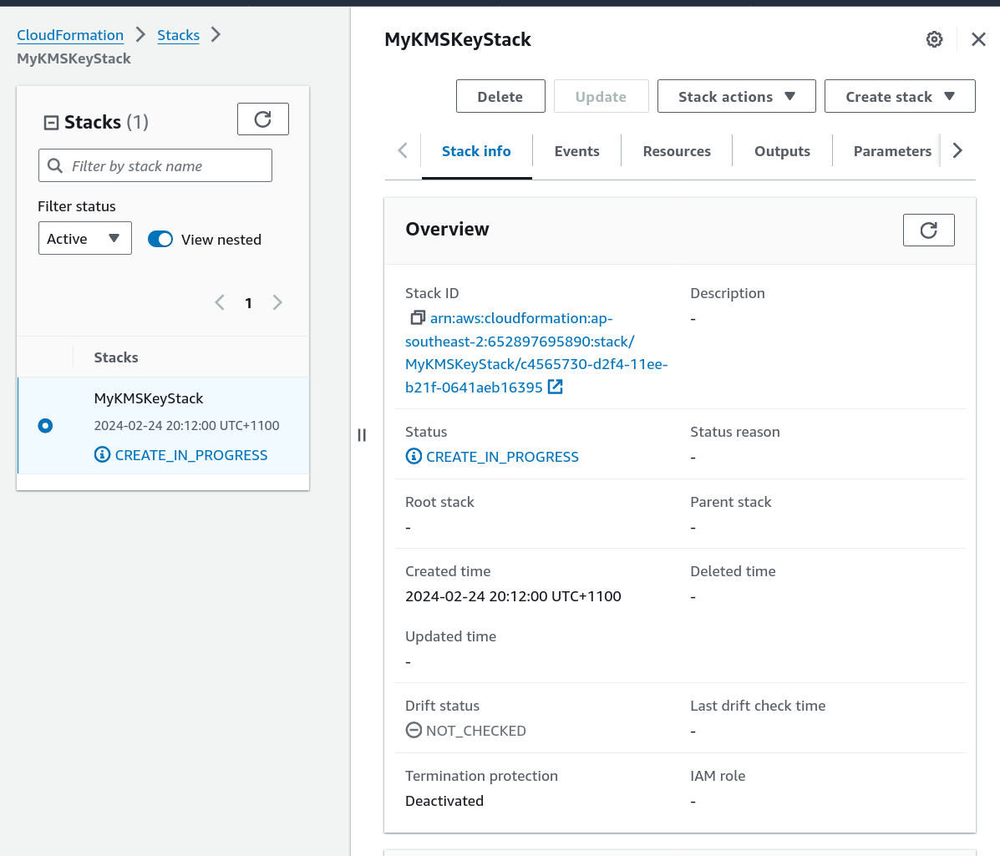

# AWS Key Management Service

## Index

## Introduction 

- AWS Key Management Service (AWS KMS) is a managed service that makes it easy for you to create and control the cryptographic keys that are used to protect your data
- AWS KMS uses hardware security modules (HSM) to protect and validate your AWS KMS keys under the FIPS 140-2 Cryptographic Module Validation Program. 
- China (Beijing) and China (Ningxia) Regions do not support the FIPS 140-2 Cryptographic Module Validation Program. 
- AWS KMS uses OSCCA certified HSMs to protect KMS keys in China Regions.
- AWS KMS keys (KMS keys) are the primary resource in AWS KMS
- An AWS KMS key is a logical representation of a cryptographic key. A KMS key contains metadata, such as the key ID, key spec, key usage, creation date, description, and key state. Most importantly, it contains a reference to the key material that is used when you perform cryptographic operations with the KMS key.
- By default, AWS KMS creates the key material for a KMS key. You cannot extract, export, view, or manage this key material. The only exception is the public key of an asymmetric key pair, which you can export for use outside of AWS
- Each AWS KMS key that you create in AWS KMS costs $1/month (prorated hourly).

The cost of each API request to AWS KMS (outside of the free tier):

Region:`ap-southeast-2`

    $0.03 per 10,000 requests
    $0.03 per 10,000 requests involving RSA 2048 keys
    $0.10 per 10,000 ECC GenerateDataKeyPair requests
    $0.15 per 10,000 asymmetric requests except RSA 2048
    $12.00 per 10,000 RSA GenerateDataKeyPair requests

## Types of KMS Keys

- Customer managed keys - The KMS keys that you create are customer managed keys
- AWS managed keys - AWS managed keys are KMS keys in your account that are created, managed, and used on your behalf by an AWS service integrated with AWS KMS
- AWS owned keys - AWS owned keys are a collection of KMS keys that an AWS service owns and manages for use in multiple AWS accounts.


## Hands-on

1. Creating a KMS key with Cloudformation 

 ```bash
    aws cloudformation create-stack \
    --stack-name MyKMSKeyStack \
    --template-body=file://create-kms-cf.yaml \
    --parameters=file://create-kms-params.json \
    --region ap-southeast-2

 ```



2. Create a KMS Key with Terraform 
 - Use the [template](create-kms.tf)
 - use `terraform validate`
 - use `terraform apply`